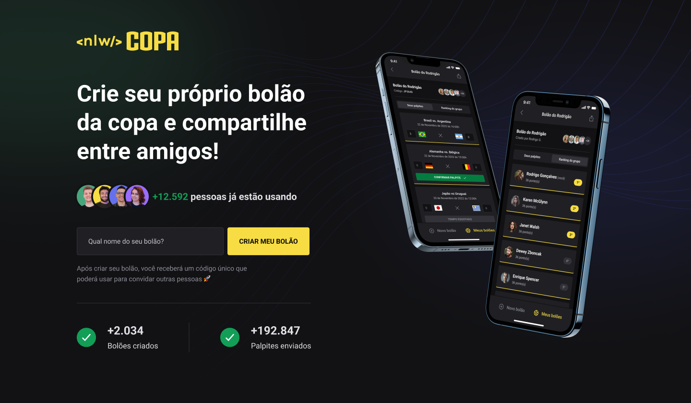

<h1 align="center">NLW Copa</h1>

  <a href="#-tecnologias">Tecnologias</a>&nbsp;&nbsp;&nbsp;|&nbsp;&nbsp;&nbsp;
  <a href="#-projeto">Projeto</a>&nbsp;&nbsp;&nbsp;|&nbsp;&nbsp;&nbsp;
  <a href="#-features">Features</a>&nbsp;&nbsp;&nbsp;|&nbsp;&nbsp;&nbsp;
  <a href="#-contato">Contato</a>

 

  

## 🚀 Tecnologias

Esse projeto foi desenvolvido com as seguintes tecnologias:

- [NodeJs](https://nodejs.org)
- [Typescript](https://www.typescriptlang.org)
- [Prisma](https://www.prisma.io)
- [Fastify](https://www.fastify.io)
- [Zod](https://zod.dev)
- [SQLite](https://www.sqlite.org/index.html)
- [React](https://reactjs.org)
- [NextJS](https://nextjs.org)
- [TailwindCSS](https://tailwindcss.com)
- [Axios](https://axios-http.com/docs/intro)
- [React Native](https://reactnative.dev)
- [Expo](https://expo.dev)
- [Native Base](https://nativebase.io)

## 💻 Projeto

Essa aplicação é um bolão dos jogos da copa, os usuários podem criar seus bolões e compatilhar com seus amigos. Projeto feito durante a NLW Copa da Rocketseat.

## ✨ Features

- Criação de um bolão;
- Contagem de bolões, usuários e palpites cadastrados;
- Schema validation utilizando o Zod;
- Diagrama ERD (entidade-relacionamento):

- Exibição da quantidade de usuários, bolões, e palpites criados;
- Dar palpite nos bolões e compartilhar;
- Autenticação de usuário feito com Google;

## 📲 Contato

Entre em contato comigo por e-mail ou pelo meu LinkedIn:

<a href="mailto:marcelodoehnert@hotmail.com">E-mail</a>&nbsp;&nbsp;&nbsp;|&nbsp;&nbsp;&nbsp;<a href="https://www.linkedin.com/in/marcelo-doehnert-cordeiro/">LinkedIn</a>
